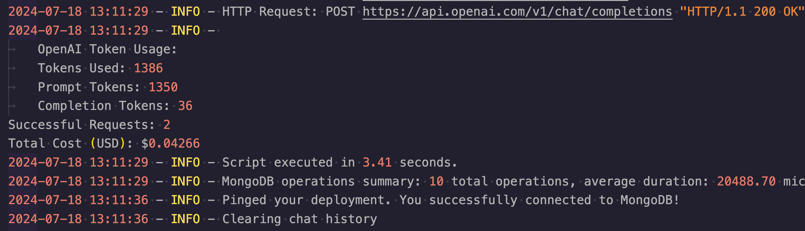
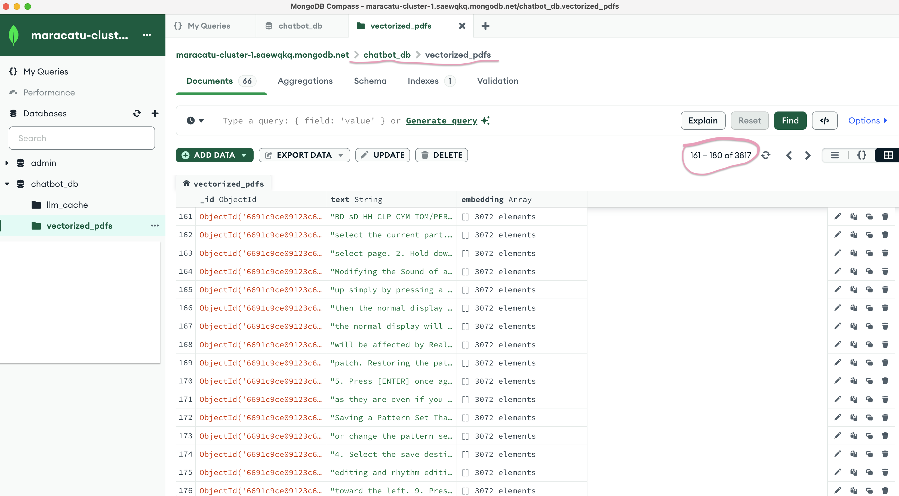

# :computer: Local Machine GenAI Chatbot  application with Streamlit, MongoDB Atlas, Langchain and OpenAI

<!-- markdownlint-disable-next-line MD033 -->
_version = 1.0.0_
<!-- markdownlint-enable MD033 -->

This Python Retrieval-Augmented Generation (RAG) application is able to read multiple PDFs - up to 200MB at a time - and answer questions based on the information in those PDFs. In simpler terms, it can find relevant information from the PDFs and use that information to answer your questions.

It was developed locally for future Cloud Deployment :cloud: - in AWS and GCP - using Serverless Containers. Application stack:

* **Streamlit** - Front End
* **OpenAi** - LLM/Foundation Model
* **Langchain** - NLP Orchestration
* **MongoDB Atlas Vector Search** - Cloud-based Vector Database
* **Dotenv** - Local secret management
* **PyPDF** - PDF text extraction
* **PyTesseract** - OCR on AES Encrypted PDFs or PDFs with images in the background that would result in an empty text extraction
 

## Key Features

* Secure API/TOKEN keys connection hidden in the `.env` file
* Processes multiple files - up to 200MB - within 1 single upload operation
* Capability to answer questions based on documents that are already vectorized and stored in the database - no need to reupload the same PDFs
* Ability to extract text from AES locked PDFs or PDFs with background images that block a simple text extraction
* Text extraction parallel processing for  PDFs > 5MB for faster application performance
* A _'Clear Chat History'_ button
* A series of observability/logs features for future Cloud Development considerations:
  * A Langchain `callback` function that calculates 'OpenAi' token usage and prints it to a logger file.
   
  * MongoDB operation specific logs recorded through the `pymongo` driver
  * A `script execution time` measurement functionality

 

---

